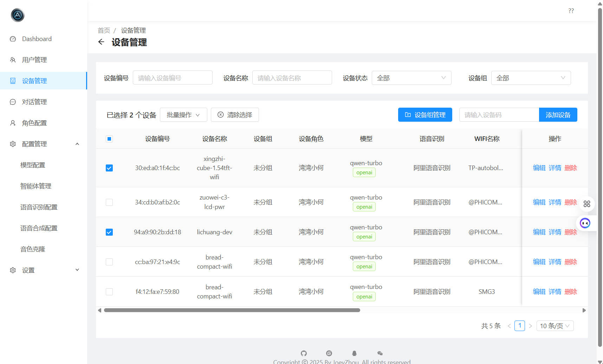
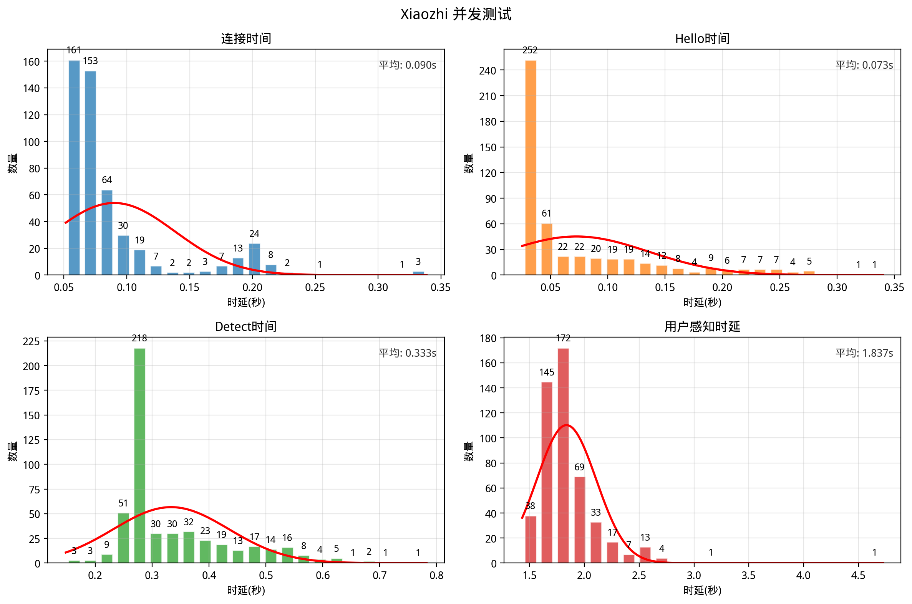

<h1 align="center">Xiaozhi ESP32 Server Java</h1>

  基于 <a href="https://github.com/78/xiaozhi-esp32">Xiaozhi ESP32</a> 项目开发的 Java 版本服务端，包含完整前后端管理平台 
  为智能硬件设备提供强大的后端支持和直观的管理界面

  <a href="https://github.com/joey-zhou/xiaozhi-esp32-server-java/issues">反馈问题</a>
  · <a href="#deployment">部署文档</a>
  · <a href="https://github.com/joey-zhou/xiaozhi-esp32-server-java/blob/main/CHANGELOG.md">更新日志</a>

  
  
  
  
  

  <b>如果这个项目对您有帮助，请考虑给它一个 ⭐ Star！</b> 
  您的支持是我们持续改进的动力！

---

## 项目简介 📝

Xiaozhi ESP32 Server Java 是基于 [Xiaozhi ESP32](https://github.com/78/xiaozhi-esp32) 项目开发的 Java 版本服务端，包含完整的前后端管理平台。该项目旨在为用户提供一个功能丰富、操作便捷的管理界面，帮助用户更好地管理设备、配置等。

考虑到企业级应用场景的需求，Java 作为一种成熟的企业级开发语言，具备更完善的生态系统支持和更强大的并发处理能力，因此我们选择开发这个 Java 版本的服务端，为项目提供更多可能性和扩展空间。

- **后端框架**：Spring Boot + Spring MVC
- **前端框架**：Vue.js + Ant Design
- **数据存储**：MySQL + Redis
- **全局响应式**：适配各种设备及分辨率

---

## 适用人群 👥

如果您已经购买了 ESP32 相关硬件，且希望通过一个功能完善、界面友好的管理平台来控制和管理您的设备，那么本项目非常适合您。特别适合：

- 需要企业级稳定性的用户
- 个人开发者，希望快速搭建使用的用户
- 希望有完整前端管理界面的用户
- 需要更强大数据管理和分析能力的用户
- 对系统扩展性有较高要求的用户
- 需要支持大量设备并发连接的场景
- 对实时数据处理有高要求的应用场景

---

## 功能模块 ✨(部分内容未开源，有需求请通过下方联系方式沟通)

### 开源版功能 🆓

| 功能模块 | 状态 | 描述 |
|---------|------|------|
| **首句响应** | ✅ | 唤醒词响应时间 >4秒 |
| **平均响应速度** | ✅ | 平均对话响应时间 >3秒 |
| **WebSocket协议** | ✅ | 高性能WebSocket通信，支持设备实时状态更新和控制 |
| **设备管理** | ✅ | 查看已接入的所有设备列表、设备状态实时监控、添加/编辑/删除设备信息 |
| **音色选择** | ✅ | 提供多种音色模板、预览音色效果、为不同设备分配不同音色配置 |
| **用户管理** | ✅ | 支持多用户配置，满足家庭多成员使用需求 |
| **聊天记录** | ✅ | 查看历史聊天记录、按日期/关键词搜索聊天内容、删除消息、清空记忆功能 |
| **智能体** | ✅ | 对接Coze与Dify等智能体平台，实现复杂场景对话能力 |
| **角色切换** | ✅ | 预设角色切换（AI老师、男/女朋友、智能家居助手等）支持语音切换角色 |
| **持久化对话** | ✅ | 支持持久化对话记录，方便查看历史对话内容 |
| **LLM多平台支持** | ✅ | 支持OpenAI、智谱AI、讯飞星火、Ollama等多种大语言模型 |
| **IoT设备控制** | ✅ | 支持通过语音指令管理IoT设备，实现智能家居控制 |
| **多语音识别服务** | ✅ | 支持Funasr、阿里、腾讯、Vosk等多种语音识别服务 |
| **Function Call** | ✅ | 支持LLM函数调用功能，实现复杂任务处理和智能决策 |
| **拍照识图** | ✅ | 支持图像识别和处理，实现更丰富的交互方式 |
| **实时打断** | ✅ | 支持实时打断功能，提高对话流畅度 |
| **记忆管理** | ✅ | 自定义记忆对话条数、历史对话总结/摘要功能、手动操作对话记录 |

### 商业版功能 💼

| 功能模块 | 状态 | 描述 |
|---------|------|------|
| **首句响应** | ✅ | 唤醒词响应时间 <1秒，极速响应体验 |
| **平均响应速度** | ✅ | 平均对话响应时间 <2.5秒，流畅对话体验 |
| **MQTT协议** | ✅ | 支持MQTT通信协议，长连接、服务端主动唤醒 |
| **音色克隆** | ✅ | 支持火山引擎与阿里云音色克隆，实现个性化声音定制 |
| **双向流式交互** | ✅ | 支持火山、阿里、讯飞流式播放，实时语音输入和回复输出 |
| **用户端** | ✅ | 友好的用户端操作界面，原生卡片方式设备管理页面 |
| **MCP接入点** | ✅ | 基于角色的MCP工具接入点，扩展功能接入 |
| **MCP服务** | ✅ | SSE MCP接入方式，支持更多第三方服务集成 |
| **Function Call安抚词** | ✅ | 工具调用前置安抚词，提升用户体验 |
| **长期记忆** | ✅ | 根据用户对话，提取关键信息记录，智能记忆管理 |
| **知识库** | ✅ | RAG检索知识库（后期拓展图知识库），文档上传，智能检索 |
| **记忆总结** | ✅ | 基于知识库长期记忆总结，智能对话分析 |
| **语音提醒与闹钟** | ✅ | 服务端主动唤醒设备下发音频内容，智能提醒功能 |
| **多设备协同** | ✅ | AB设备协同播放，全屋智能协同工作 |
| **监控面板** | ✅ | 监控日、周、月不同维度Token，对话时长，设备活跃等数据 |
| **OTA固件升级** | ✅ | 固件上传，自动升级，远程设备管理 |
| **聊天数据可视化** | ✅ | 聊天频率统计图表等数据可视化功能，监控对话数据趋势 |

### 开发中功能 🚧

| 功能模块 | 状态 | 描述 |
|---------|------|------|
| **混合模式角色** | 🚧 | 支持多角色混合模式，通过不同唤醒词唤醒不同角色（自动切换） |
| **声纹识别** | 🚧 | 支持声纹识别功能，实现个性化语音助手 |
| **多语言支持** | 🚧 | 支持多语言界面，满足不同地区用户需求 |
| **Home Assistant** | 🚧 | 支持智能家居设备控制，通过语音指令管理Home Assistant设备 |
| **情感分析** | 🚧 | 通过语音情感分析，提供更人性化的回复 |
| **自定义插件系统** | 🚧 | 支持自定义插件开发，扩展系统功能 |
| **远程控制** | 🚧 | 支持远程控制设备，实现外出时的设备管理 |

---

## UI 展示 🎨

    
    
<strong>设备管理</strong> - 全面管理和监控所有连接设备

  

    <strong>👉 点击查看更多界面截图 👈</strong>
  

  
  

    
    
<strong>登录界面</strong> - 安全访问系统的入口

    
    
<strong>仪表盘</strong> - 系统概览和关键数据展示

    
    
<strong>用户管理</strong> - 管理用户信息和权限

    
    
<strong>消息记录</strong> - 查看和搜索历史对话内容

    
    
<strong>模型管理</strong> - 配置和管理AI模型

    
    
<strong>智能体管理</strong> - 设置和切换智能体，Coze/Dify

    
    
<strong>角色管理</strong> - 设置和切换AI角色

    
    
<strong>音色克隆</strong> - 克隆自己的声音，实现个性化语音助手

  

---

## 部署文档 📚

我们提供了多种部署方式，以满足不同用户的需求：

### 1. 本地源码运行

- [Windows部署文档](./docs/WINDOWS_DEVELOPMENT.md) - 适合Windows环境开发和测试
- [CentOS部署文档](./docs/CENTOS_DEVELOPMENT.md) - 适合Linux服务器环境部署

成功运行后，控制台会输出 OTA 和 WebSocket 连接地址，根据固件编译文档使设备接入服务使用。

### 2. Docker部署

- [Docker部署文档](./docs/DOCKER.md) - 快速容器化部署方案

### 3. 固件编译

- [固件编译文档](./docs/FIRMWARE-BUILD.md) - 详细的固件编译和烧录过程

烧录成功且联网成功后，通过唤醒词唤醒小智，留意后端控制台输出的信息。

---

## 性能测试 🔬

我们开发了专门的 WebSocket 并发测试工具 [Xiaozhi Concurrent](https://github.com/joey-zhou/xiaozhi-concurrent)，用于评估系统的性能和稳定性。测试工具支持模拟大量设备同时连接，测试完整的 WebSocket 通信流程，并生成详细的性能报告和可视化图表。

> 📖 测试工具的详细使用说明、安装步骤和参数配置请查看：[Xiaozhi Concurrent 仓库](https://github.com/joey-zhou/xiaozhi-concurrent)

### 基准测试结果

以下测试数据基于**腾讯云服务器（8核8G，100M按量付费带宽）** 环境，**100个设备、100并发连接、持续5轮** 对话测试：

#### 性能指标

| 测试项目 | 成功率 | 平均时延 | 最小值 | 最大值 | 备注 |
|---------|-------|---------|-------|-------|------|
| WebSocket连接 | 100% (500/500) | 0.090s | - | - | 建立连接耗时 |
| Hello握手 | 100% (500/500) | 0.073s | - | - | 握手响应时间 |
| 唤醒词响应 | 100% (500/500) | 0.333s | - | - | 唤醒词到音频回复 |
| 语音识别准确率 | 100% (500/500) | - | - | - | 真实音频识别 |
| 语音识别时延 | - | 0.988s | 0.949s | 1.255s | ASR识别耗时（包含800ms静音） |
| 服务器处理时延 | - | 0.849s | 0.454s | 3.759s | 服务端处理耗时（LLM+TTS） |
| 用户感知时延 | - | 1.837s | 1.433s | 4.723s | 说话结束到收到回复 |

#### 服务器资源占用

| 资源类型 | 空闲时 | 峰值 | 说明 |
|---------|-------|------|------|
| CPU使用率 | 0% | 80% | 8核CPU占用率 |
| 内存占用 | 1.8G | 1.96G | JVM堆内存稳定 |
| 网络带宽(上行) | 0 | 2200KB/s | 客户端音频上传 |
| 网络带宽(下行) | 0 | 3300KB/s | 服务端音频下发 |
| WebSocket连接数 | 0 | 100 | 并发活跃连接数 |

#### 音频传输质量

| 指标 | 数值 | 说明 |
|-----|------|------|
| 音频帧平均间隔 | 58.07ms | 音频帧发送间隔 |
| 帧延迟率 | 8.47% (4226/49918) | >65ms |

### 测试结果可视化

    
    
<strong>并发测试数据可视化</strong> - 时延分布与性能指标统计

---

## 开发路线图 🗺️

根据我们的[项目开发需求清单](https://github.com/users/joey-zhou/projects/1)，未来我们计划实现以下功能：

### 近期计划 (2025 Q2)
- 完善Function Call功能，支持更多复杂任务处理
- 实现多角色混合模式，支持不同唤醒词唤醒不同角色
- 优化记忆管理系统，提供更灵活的历史对话管理
- 实现聊天数据可视化功能，提供数据分析能力

### 中期计划 (2025 Q3-Q4)
- 实现声纹识别功能，支持个性化语音助手
- 完善Home Assistant集成，提供更全面的智能家居控制能力
- 开发多模态交互功能，支持图像识别和处理
- 实现自定义插件系统，支持功能扩展

### 长期计划 (2026+)
- 开发多设备协同工作机制，实现全屋覆盖的语音助手系统
- 实现情感分析功能，提供更人性化的交互体验
- 开发知识库集成功能，增强问答能力
- 实现多用户支持，满足家庭多成员使用需求

我们将根据社区反馈和技术发展不断调整开发计划，确保项目持续满足用户需求。

---

## 贡献指南 👐

欢迎任何形式的贡献！如果您有好的想法或发现问题，请通过以下方式联系我们：

### 微信

欢迎加入我们的Wechat群一起交流讨论

### QQ

欢迎加入我们的QQ群一起交流讨论，QQ群号：790820705

### 定制开发

我们接受各种定制化开发项目，如果您有特定需求，欢迎通过微信联系洽谈。

---

## 免责声明 ⚠️

本项目仅提供音乐和绘本播放的技术实现代码，不提供任何媒体内容。用户在使用相关功能时应确保拥有合法的使用权或版权许可，并遵守所在地区的版权法律法规。

项目中可能涉及的示例内容或资源均来自网络或由用户投稿提供，仅用于功能演示和技术测试。如有任何内容侵犯了您的权益，请立即联系我们，我们将在核实后立即采取删除等处理措施。

本项目开发者不对用户使用本项目代码获取或播放的任何内容承担法律责任。使用本项目即表示您同意自行承担使用过程中的全部法律风险和责任。

---

## Star History 📈

<a href="https://www.star-history.com/#joey-zhou/xiaozhi-esp32-server-java&Date">
 <picture>
   <source media="(prefers-color-scheme: dark)" srcset="https://api.star-history.com/svg?repos=joey-zhou/xiaozhi-esp32-server-java&type=Date&theme=dark" />
   <source media="(prefers-color-scheme: light)" srcset="https://api.star-history.com/svg?repos=joey-zhou/xiaozhi-esp32-server-java&type=Date" />
   
 </picture>
</a>